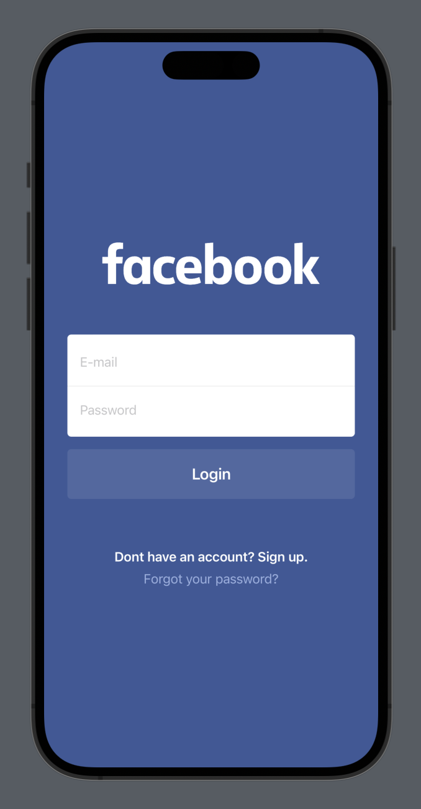
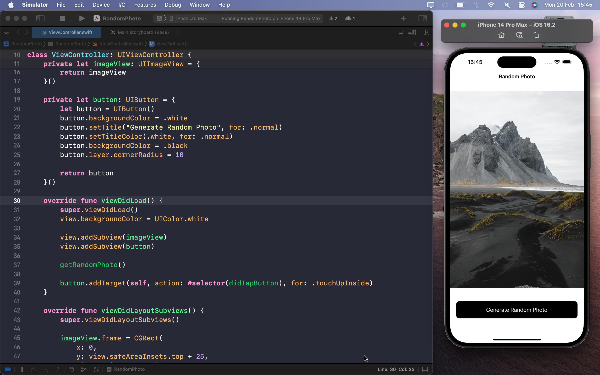
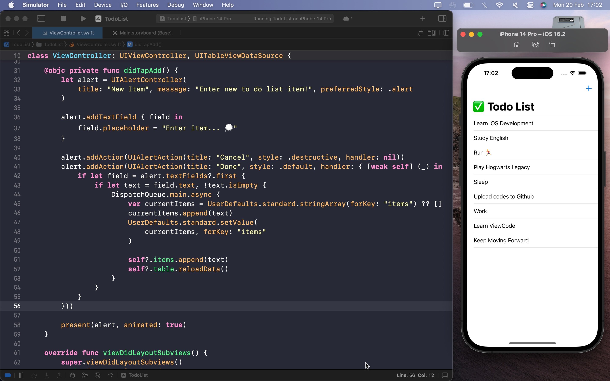
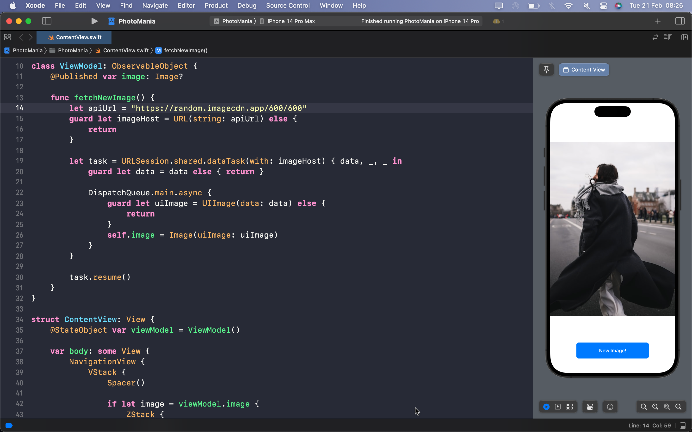

# 📱 My iOS Projects

  <h3>App Name: <strong>Facebook Login Screen</strong></h3>
  <h4>Created with: <strong>Swift UI</strong></h4>
  <h4>Repository: <strong><a href="https://github.com/iamdevmarcos/FacebookLoginUI">Click here</a></strong></h4>

  <h4>Preview -></h4>
  

 

  <h3>App Name: <strong>Random Photos</strong></h3>
  <h4>Created with: <strong>UI Kit + Storyboard</strong></h4>
  <h4>Repository: <strong><a href="#">Click here</a></strong></h4>

  <h4>Preview -></h4>
  

 

  <h3>App Name: <strong>Todo List</strong></h3>
  <h4>Created with: <strong>UI Kit + Storyboard</strong></h4>
  <h4>Repository: <strong><a href="https://github.com/iamdevmarcos/TodoList">Click here</a></strong></h4>

  <h4>Preview -></h4>
  

 

  <h3>App Name: <strong>Photo Mania</strong></h3>
  <h4>Created with: <strong>Swift UI</strong></h4>
  <h4>Repository: <strong><a href="https://github.com/iamdevmarcos/PhotoMania">Click here</a></strong></h4>

  <h4>Preview -></h4>
  

